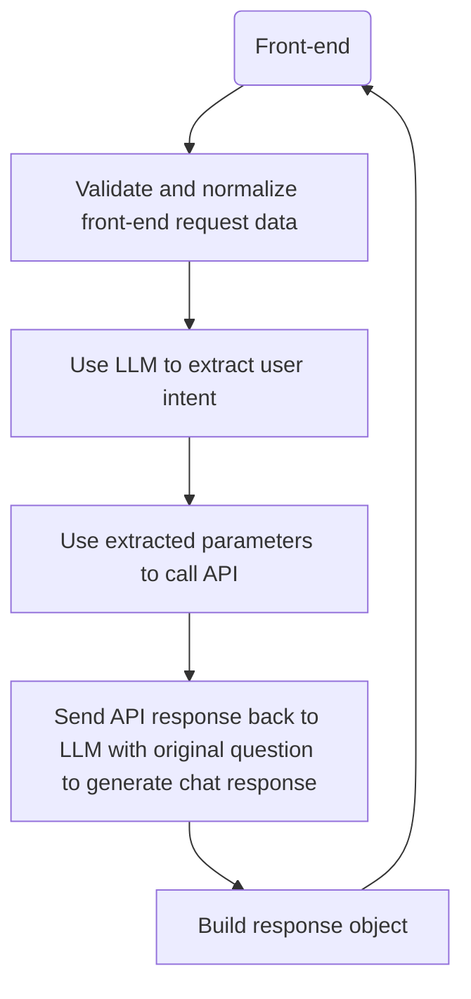

# Chat with your API from Prompt flow

This sample demonstrates using an LLM to understand user intent and call an underlying API. While OpenAI supports function calling, we found using the whole prompt to extract parameter values with chain of thought and few-shot learning to be valuable.



## Get started

**Install dependencies**

- Bootstrap your python environment.
  - e.g: create a new [conda](https://conda.io/projects/conda/en/latest/user-guide/getting-started.html) environment. `conda create -n pf-examples python=3.9`.
  - install required packages in python environment : `pip install -r requirements.txt`
    - show installed sdk: `pip show promptflow`
- Create an Azure OpenAI resource and set up the connection
    ``` bash
    pf connection create -f chat-with-weather-api\azure_openai.yaml --set api_key=<your-aoai-key> api_base=<your-aoai-endpoint>
    ```
- Modify the call_api tool and prompts to consider your API use case
- Build Docker image
- [Deploy to your container host of choice!](https://microsoft.github.io/promptflow/how-to-guides/deploy-a-flow/index.html)
- You can optionally save chat history to Azure Cosmos DB. The partition key is __/sessionId__  
  The following environment variables need to be set:  
  
    __COSMOS_ENDPOINT__  
    __COSMOS_KEY__  
    __DATABASE_NAME__  
    __CONTAINER_NAME__  
    __ENABLE_COSMOS_DB__  

## Contributing

This project welcomes contributions and suggestions.  Most contributions require you to agree to a
Contributor License Agreement (CLA) declaring that you have the right to, and actually do, grant us
the rights to use your contribution. For details, visit https://cla.opensource.microsoft.com.

When you submit a pull request, a CLA bot will automatically determine whether you need to provide
a CLA and decorate the PR appropriately (e.g., status check, comment). Simply follow the instructions
provided by the bot. You will only need to do this once across all repos using our CLA.

This project has adopted the [Microsoft Open Source Code of Conduct](https://opensource.microsoft.com/codeofconduct/).
For more information see the [Code of Conduct FAQ](https://opensource.microsoft.com/codeofconduct/faq/) or
contact [opencode@microsoft.com](mailto:opencode@microsoft.com) with any additional questions or comments.

## Trademarks

This project may contain trademarks or logos for projects, products, or services. Authorized use of Microsoft 
trademarks or logos is subject to and must follow 
[Microsoft's Trademark & Brand Guidelines](https://www.microsoft.com/en-us/legal/intellectualproperty/trademarks/usage/general).
Use of Microsoft trademarks or logos in modified versions of this project must not cause confusion or imply Microsoft sponsorship.
Any use of third-party trademarks or logos are subject to those third-party's policies.
